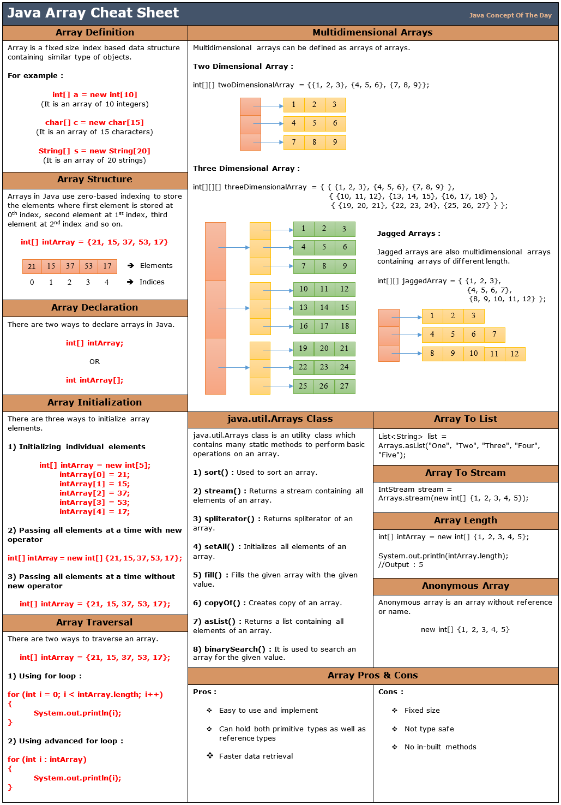

# Arrays

Author: [Jagadeesh C](https://github.com/)

[README](../README.md)

<div align="center">
    
</div>

## Arrays 🤔 ⁈

In Java, an array is a data structure that allows you to store a **fixed-size collection** of elements of the **same
data
type**.

- Arrays are used to store and manipulate multiple values of the same type under a single variable name.
- Each element in an array is accessed by its index, which is an integer value that represents its position in the
  array. The first element in an array has an index of 0, the second element has an index of 1, and so on.

Here are some important aspects of arrays in Java:

#### 1. Declaration and Initialization:

- To declare an array, you specify the data type of the elements it will hold, followed by square brackets [], and then
  the array name.
- Arrays can be initialized when declared or later using the new keyword. Here are some examples:

```java
// Declare and initialize an array of integers
int[] numbers = {1,2,3,4,5};

// Declare an array of strings without initialization
String[] names;

// Initialize the array later
names = new String[3];
```

#### 2. Array Length:

You can determine the length (number of elements) of an array using the **length** property.
For example:

```java
int[] numbers = {1, 2, 3, 4, 5};
int length = numbers.length; // length is 5
```

#### 3. Accessing Elements:

Elements in an array are accessed using square brackets and the element's index. Remember that array indices start at 0.
For example:

```java
int[] numbers = {1, 2, 3, 4, 5};
int firstNumber = numbers[0]; // Access the first element (1)
```

#### 4. Iterating Through Arrays:

You can use loops, such as **for** or **foreach**, to iterate through the elements of an array:

```java
int[] numbers = {1, 2, 3, 4, 5};

for (int i = 0; i < numbers.length; i++) {
  System.out.println(numbers[i]);
}
```

Or, using the enhanced for loop (foreach):

```java
int[] numbers = {1, 2, 3, 4, 5};

for (int num : numbers) {
  System.out.println(num);
}
```

#### 5. Arrays are Fixed-Size:

In Java, arrays have a fixed size, meaning once you declare an array with a specific size, you cannot change it. If you
need a dynamic-sized collection, you might want to consider using ArrayList or other collection classes.

#### 6. Array Types:

You can create arrays of any data type, including primitive types (int, char, etc.) and reference types (objects,
strings, etc.).

```java
String[] names = {"Alice", "Bob", "Charlie"};
double[] prices = {19.99, 29.99, 39.99};
```

#### 7. Array Manipulation:

You can modify elements in an array by assigning new values to them or use methods to manipulate array contents.

```java
int[] numbers = {1, 2, 3, 4, 5};
numbers[2] = 10; // Change the third element to 10
```

Arrays are fundamental in Java and are used extensively in many programs to store and process collections of data
efficiently. Understanding how to work with arrays is essential for Java developers.

#### 8. Cheat Sheet

<div align="center">
    
</div>

#### 9. Interview ⭐️

1. **Basic Array Operations**:

   - To declare an array in Java, you specify the data type of the elements it will hold, followed by square brackets `[]`, and then the array name. For example: `int[] numbers;`
   - To initialize an array, you can use curly braces `{}` and provide the initial values. For example: `int[] numbers = {1, 2, 3};`
   - The default value for elements in an integer array is 0.
   - You can find the length of an array using the `length` property. For example: `int length = numbers.length;`
   - An array is a fixed-size data structure, while an ArrayList is a dynamic-size data structure that can grow or shrink as needed.

2. **Accessing and Modifying Elements**:

   - You access elements in an array using square brackets and the element's index. For example: `int thirdElement = numbers[2];`
   - To change the value of an element in an array, you use the assignment operator. For example: `numbers[1] = 10;`
   - If you try to access an element at an invalid index, you will get an `ArrayIndexOutOfBoundsException` at runtime.

3. **Array Traversal**:

   - You can iterate through the elements of an array using a `for` loop or an enhanced `for` loop (foreach loop).
   - Here's an example of traversing an array using a `for` loop:

   ```java
   for (int i = 0; i < numbers.length; i++) {
       System.out.println(numbers[i]);
   }
   ```

4. **Array Initialization**:

   - You can initialize an array in several ways, including static initialization (providing values when declaring) and dynamic initialization (using the `new` keyword).
   - Arrays have a fixed size, so you cannot change their size once they are initialized.

5. **Multidimensional Arrays**:

   - A multidimensional array is an array of arrays. For example, a 2D array is an array of rows, each containing an array of elements.
   - You declare and initialize a 2D array like this:

   ```java
   int[][] matrix = {
       {1, 2, 3},
       {4, 5, 6},
       {7, 8, 9}
   };
   ```

6. **Common Array Algorithms**:

   - For reversing an array, you can iterate through the array and swap elements from the start with elements from the end until you reach the middle.
   - To find the maximum and minimum elements in an array, you can iterate through the array while keeping track of the current maximum and minimum values.

7. **Array Sorting**:

   - You can use the `Arrays.sort()` method to sort an array in ascending order. For custom sorting, you can implement your own sorting algorithm.

8. **Array Manipulation**:

   - To remove an element from an array, you typically need to create a new array without the element you want to remove.
   - To insert an element at a specific position in an array, you may need to shift existing elements to make room for the new element.

9. **Array Efficiency**:

   - Common array operations have varying time complexities. Accessing an element is O(1), searching is O(n), and sorting is O(n log n) for efficient sorting algorithms.

10. **Array vs. ArrayList**:

    - Arrays are fixed-size, while ArrayLists can dynamically resize.
    - Arrays are more memory-efficient for primitive types, whereas ArrayLists are better for objects.
    - Use ArrayList when you need dynamic sizing, and arrays when a fixed size suffices.

11. **Array Challenges**:

    - Coding challenges can involve tasks like finding pairs with a specific sum, finding duplicates, or rotating an array.

12. **Memory Allocation**:

    - In Java, arrays are stored in heap memory, and references to arrays are stored in stack memory.

13. **Java Streams and Arrays**:

    - Java streams provide a powerful way to process arrays using functional programming constructs.

14. **Concurrency and Arrays**:

    - To ensure thread safety with arrays, use synchronization mechanisms such as `synchronized` blocks or consider using thread-safe data structures like `CopyOnWriteArrayList`.

15. **Exception Handling with Arrays**:
    - You handle `ArrayIndexOutOfBoundsException` by catching it with a try-catch block or by ensuring that your code accesses array elements within valid index bounds.

#### 10. Essential algorithmic problem-solving coding excercise

**1. Find the Missing Number**

- Problem: Given an array containing n distinct numbers taken from 0 to n, find the missing number.
- Solution: You can solve this problem by calculating the expected sum of the first n natural numbers and subtracting the sum of the array elements.

```java
public int missingNumber(int[] nums) {
    int n = nums.length;
    int expectedSum = n * (n + 1) / 2;
    int actualSum = 0;
    for (int num : nums) {
        actualSum += num;
    }
    return expectedSum - actualSum;
}
```

**2. Two Sum**

- Problem: Given an array of integers, find two numbers such that they add up to a specific target number.
- Solution: You can use a HashMap to store the complement of each element as you iterate through the array.

```java
public int[] twoSum(int[] nums, int target) {
    Map<Integer, Integer> map = new HashMap<>();
    for (int i = 0; i < nums.length; i++) {
        int complement = target - nums[i];
        if (map.containsKey(complement)) {
            return new int[] { map.get(complement), i };
        }
        map.put(nums[i], i);
    }
    throw new IllegalArgumentException("No solution found");
}
```

**3. Container With Most Water**

- Problem: Given n non-negative integers representing the height of walls, find the maximum amount of water that can be trapped between the walls.
- Solution: Use a two-pointer approach to find the maximum area while moving the pointers toward each other.

```java
public int maxArea(int[] height) {
    int left = 0, right = height.length - 1;
    int maxArea = 0;

    while (left < right) {
        int minHeight = Math.min(height[left], height[right]);
        int currentArea = (right - left) * minHeight;
        maxArea = Math.max(maxArea, currentArea);

        if (height[left] < height[right]) {
            left++;
        } else {
            right--;
        }
    }

    return maxArea;
}
```

**4. Merge Intervals**

- Problem: Given a collection of intervals, merge any overlapping intervals.
- Solution: Sort the intervals by their start times and then merge overlapping intervals while iterating through the sorted list.

```java
public int[][] merge(int[][] intervals) {
    if (intervals.length <= 1) {
        return intervals;
    }

    Arrays.sort(intervals, (a, b) -> a[0] - b[0]);

    List<int[]> merged = new ArrayList<>();
    int[] currentInterval = intervals[0];

    for (int i = 1; i < intervals.length; i++) {
        if (currentInterval[1] >= intervals[i][0]) {
            currentInterval[1] = Math.max(currentInterval[1], intervals[i][1]);
        } else {
            merged.add(currentInterval);
            currentInterval = intervals[i];
        }
    }

    merged.add(currentInterval);
    return merged.toArray(new int[merged.size()][]);
}
```

**5. Rotate Array**

- Problem: Rotate an array to the right by k steps.
- Solution: You can rotate the array in-place by reversing the first n-k elements, then reversing the remaining k elements, and finally reversing the entire array.

```java
public void rotate(int[] nums, int k) {
    int n = nums.length;
    k = k % n;
    reverse(nums, 0, n - k - 1);
    reverse(nums, n - k, n - 1);
    reverse(nums, 0, n - 1);
}

private void reverse(int[] nums, int start, int end) {
    while (start < end) {
        int temp = nums[start];
        nums[start] = nums[end];
        nums[end] = temp;
        start++;
        end--;
    }
}
```

These coding questions cover a range of difficulty levels and concepts related to arrays and are commonly used in technical interviews. Make sure to understand the solutions and practice solving similar problems to improve your problem-solving skills.

## References

- [Tbd](http://tbd.com)
